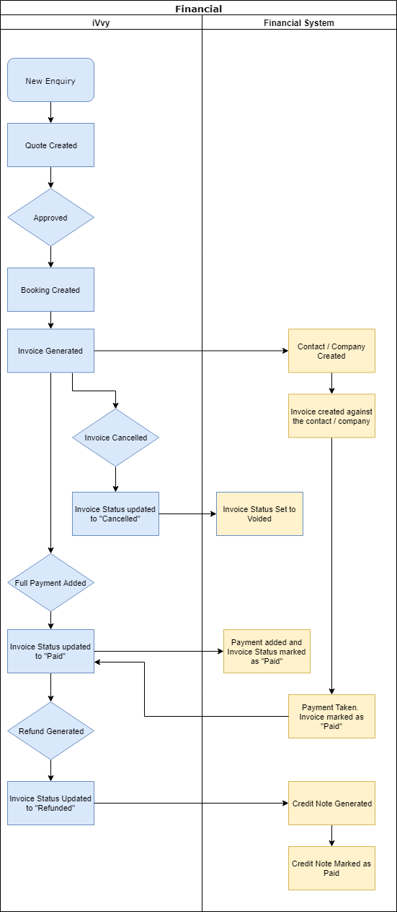

# Financial Accounting Systems

Financial integrations compose of copying the financial history out of iVvy and into a users financial system for reconciliation and reporting. 

As there is a vast difference between the way the venues and events invoicing systems work, historically they have been completed separately. Typically iVvy only sync paid invoices on Event Integrations, as events invoices can constantly change up until the point they are paid. However venues invoices do not commonly change, so the process of syncing them and paying them later is followed in the Venues integration. 

When creating a financial integration there are a lot of different steps and scenarios to consider. 
1. __Contact or Company:__ Each invoice will need to have a contact and/or company assigned
2. __Currency:__ What currency is the invoice in, and how does it need to be added into the financial system. 
3. __Tax:__ Tax tax rate is the invoice and its line items using, and how is this translated into the financial system. 
4. __Item Ledger Accounts:__ Line items in a financial system will typically have a revenue account assigned. Logic around achieving this will need to be decided. 
5. __Bank accounts:__ When transferring payments into a financial system, the bank account that the funds are sitting in needs to be allocated. 
6. __Historical Data:__ If you want to do historical data or just data from when the installation occurs. 
7. __Transferring payments both ways:__ This is a common scenario if a user 
 * Has a payment gateway in iVvy
 * Is adding payments through the financial system to the invoices, such as a bank feed directly into their finance program. 
8. __Existing Contacts:__ Financial systems may already have a debtor list. A good algorithm to match up contacts in iVvy and the Financial System when syncing invoices and creating a constant between the two such as a contact ID is highly recommended to avoid duplicates.

No two users are the same so iVvy integrations normally offer these as options for the user to set during installation rather than hard wiring them. This allows more flexibility for the end user. 

# Common API Actions that would be used in a financial Integration
1. Fetch the Invoices
Invoices can be fetched from iVvy via the [getInvoice](../../invoice/get-invoice.md) and [getInvoiceList](../../invoice/get-invoice-list.md)  API actions. 
From these actions currency, tax, items and payment information can be accessed. If completing a separate events or venue integration [filtering by refType](../../invoice/get-invoice-list#reference-type) is recommended to get the correct invoices that need to be sourced. 

One important thing to note for invoices is they may not always have a company ID or contact ID. Invoices in iVvy can be assigned to an “Other”. So this makes working with a contact database tricky in this situation. Typically if there is no contact or company for the invoice the default contact/company is sourced from the Booking or the Event that the invoice is associated with to create the corresponding contact in the Financial System.

2. Fetching a contact or company for each invoice
A contact or company can be fetched from the iVvy system using the Get Contact / Get Contact List or Get Company / Get Company List actions. The list actions return different data to the individual actions so make sure you are calling the correct action that returns the information you are looking for. Both may be used in some cases. 

3. Mapping an Invoice Status
It is recommended to look at the invoice status in iVvy and the financial system and map them accordingly deciding on what behavior happens as the status changes in iVvy. The list of iVvy invoice status can be found here. 

4. Assigning line items to an account in the Financial System
Each line item in iVvy has a refType. These are iVvy constants that could be used to map to a revenue account in the financial system. These can be accessed by the getOptions action.

5. Adding a payment back to iVvy on a two way sync
If both systems are taking payments it makes sense to transfer payments back to iVvy that were taking in the financial system. This can be done by the Add Payment endpoint. The invoice has to be existing in iVvy already (a new one cannot be created), and invoices cannot be overpaid via the API. 

# Venues Invoices
Please note this is a general overview which changes for different financial systems depending on how the system works with credit notes and refunds. 

# Events Invoices
Please note this is a general overview which changes for different financial systems depending on how the system works with credit notes and refunds. The iVvy events API does not pass credit note information so if a user needs to create a refund/credit this is done manually in the financial system. 

